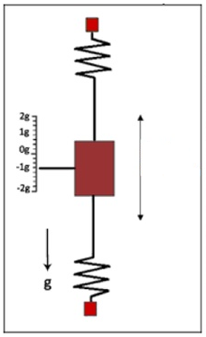
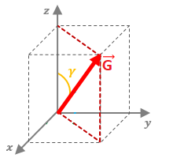

# angle-detector
The project consists of the development of a system that allows measuring the angle regarding to the horizontal using the reading of an accelerometer. The desired inclination can be programmable via keyboard, and a buzzer will sound when the level is achieved.

The user can select between using 2 different accelerometers, MPU6020 (with a digital output) or MMA7361 (with an analog output), and compare the results.

The processing is carried out with a LPC1769 microcontroller from the Cortex-M3 family, using FreeRTOS as the operating system.

## Fundamentals

Acceleration is the change in velocity per unit of time, that is, the rate of change in velocity with respect to time.

> a = dv / dt

Newton's Second Law indicates that for a body with constant mass, the body's acceleration is proportional to the force acting on it.

> a = F / m

This second concept is used by accelerometers to measure acceleration. Accelerometers have internally a MEMS (Micro Electro-Mechanical System) that, similar to a mass-spring system, allows acceleration to be measured.

With an accelerometer we can measure this acceleration, taking into account that even though there is no movement, the sensor will always be affected by gravity.

## Measuring the inclination

The accelerometer is always affected by the acceleration of gravity, which is equal to 1g.

Algebraically, gravity can be seen as a vector, where the values measured by the accelerometer are nothing more than the projections of gravity on each of its axis.

When it is in a perfectly horizontal position, the gravity vector is aligned with the z axis, so the acceleration value measured on this axis will be 1g, and the value of 0g will correspond to the other axes.

As we tilt the accelerometer, the value measured on the z axis will decrease, to the point of being 0g when the position is perfectly vertical.

This action of tilting the accelerometer can be imagined as a vector that detaches itself from the z axis and approaches the xy plane (in reality the gravity vector remains fixed and what is moving is our system of axis).

In the figure we can see the gamma tilt angle. The projection of G on the z axis can be calculated as:

> Gz = G . cos( γ )

G is known and constant, and we also know the value of Gz since it is the value delivered by the accelerometer, with which we can calculate the inclination as:

> γ = acos( Gz / G )
